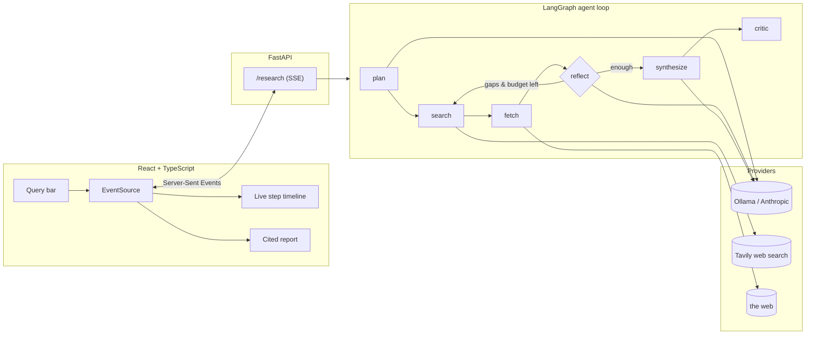

# Deep Research Agent

> A local-first, agentic research assistant. Ask a question; it plans a strategy, searches the web,
> reads and de-duplicates sources, **reflects on gaps in a loop**, and streams back a **cited**
> markdown report — powered by a local [Ollama](https://ollama.com) model (or a cloud model, one env var away).

<p align="center"><em>Think "local, hackable Perplexity" — built to showcase agent-loop engineering, not just an LLM call.</em></p>

> **Demo:** run the stack locally (see [Quickstart](#quickstart)) and drop a screen recording at
> `docs/demo.gif` — the README will pick it up here.

---

## Why this project exists

Most "AI app" demos are a single prompt behind a text box. This one is deliberately built to show the
**engineering around** an agent — the things that matter when an LLM feature has to be reliable,
observable, and testable:

| Concern | How it's addressed |
| --- | --- |
| **A real agent loop** | An explicit [LangGraph](https://langchain-ai.github.io/langgraph/) state machine (`plan → search → fetch → reflect ↺ → synthesize → critic`) with a hard iteration budget. |
| **Provider independence** | Everything talks to one `get_llm()` factory. Local Ollama by default; switch to a cloud model with `LLM_PROVIDER=anthropic`. |
| **Tools as first-class citizens** | Web search (Tavily) and page extraction are schema'd, registry-managed tools — callable from nodes *or* bindable to a model. |
| **Observability** | Every node emits a structured `StepEvent` (with token accounting) over a stream, forwarded to the UI via SSE. |
| **Evaluation** | An eval harness scores reports on citation validity, source coverage, keyword recall, and an LLM-judge rubric. |
| **Production hygiene** | Strict `mypy`, `ruff`, `pytest`, GitHub Actions CI, Docker Compose, typed config. |

## Architecture



### The loop, in words

1. **plan** — the model decomposes the question into 3–5 focused search queries.
2. **search** — each query hits Tavily; new results are de-duplicated by URL.
3. **fetch** — the top-scoring pages are downloaded and reduced to clean article text.
4. **reflect** — the model judges coverage. If gaps remain *and* the iteration budget isn't spent,
   it emits fresh follow-up queries and the graph **loops back to search**. Otherwise it moves on.
5. **synthesize** — a cited markdown report is written from the gathered evidence.
6. **critic** — every `[n]` citation is verified to point at a real source.

## Quickstart

**Prerequisites:** Python 3.12 + [`uv`](https://docs.astral.sh/uv/), Node 20+, an Ollama install, and a
free [Tavily](https://app.tavily.com) API key.

```bash
# 0) A tool-capable local model (tiny models can't do tool calls reliably)
ollama pull qwen2.5:7b-instruct

# 1) Backend
cd backend
uv sync
cp .env.example .env          # then set TAVILY_API_KEY
uv run research "What are the tradeoffs of RAG vs fine-tuning in 2025?"   # CLI
uv run uvicorn app.main:app --reload                                     # API on :8000

# 2) Frontend (new terminal)
cd frontend
npm install
npm run dev                   # http://localhost:5173
```

### Or with Docker

```bash
cp backend/.env.example backend/.env    # set TAVILY_API_KEY
docker compose up --build               # UI on :5173, API on :8000, Ollama on the host
```

### Switching to a cloud model

```bash
# in backend/.env
LLM_PROVIDER=anthropic
ANTHROPIC_API_KEY=sk-ant-...
# then: uv sync --extra anthropic
```

## Evaluation

```bash
cd backend
uv run python evals/run_evals.py --limit 3     # quick sweep
uv run python evals/run_evals.py               # full dataset + LLM judge
```

Prints a per-question table (source coverage, keyword recall, judge score) and aggregates, and saves a
JSON report under `evals/results/`. The deterministic metrics live in `app/evals/metrics.py` and are
unit-tested, so scoring logic is covered by CI even though full runs need a live model.

## Observability

Every run is observable at three levels:

- **Live** — each node emits a structured `StepEvent` (with token usage) streamed to the CLI and,
  in the API, over SSE to the browser timeline.
- **Persisted** — with `PERSIST_TRACES=true` (default), every run is written to
  `runs/<timestamp>-<slug>.jsonl`: a `run` header, one `step` line per event, and a final `result`
  with the report, sources, token totals and duration. No external account needed — grep it, diff it,
  show it in a PR. The CLI prints the path; `--verbose` also surfaces INFO logs.
- **LangSmith (opt-in)** — set `LANGSMITH_TRACING=true` + `LANGSMITH_API_KEY` to get a full
  per-LLM-call / per-graph-step trace UI. LangGraph auto-instruments, so no agent code changes;
  the app just bridges your `.env` config into the environment LangChain reads. `/health` reports
  whether it's active.

```jsonc
// a line from runs/…​.jsonl
{"type": "step", "node": "reflect", "phase": "complete",
 "message": "Gaps remain; running 2 follow-up queries", "tokens": 96}
```

## Project structure

```
backend/
  app/
    config.py            # typed settings (pydantic-settings)
    llm/provider.py      # provider-agnostic get_llm() factory
    tools/               # web_search (Tavily), web_fetch (trafilatura), registry
    agent/               # state, nodes, graph, prompts — the LangGraph loop
    telemetry/           # StepEvents + logging/token accounting
    evals/metrics.py     # deterministic report scoring
    main.py              # FastAPI + SSE
    cli.py               # terminal runner
  evals/                 # dataset + LLM-judge runner
  tests/                 # unit + offline end-to-end tests
frontend/                # Vite + React + TS UI (live trace + report)
```

## Design notes

- **Why deterministic orchestration instead of a free-running tool-calling agent?**
  Small local models are unreliable at multi-step tool calling. Keeping the loop in code makes runs
  reproducible and debuggable, while tools remain real, schema'd, and bindable — the best of both.
- **Why SSE (not WebSockets)?** The data flow is one-directional (server → UI) and SSE works with the
  browser's native `EventSource`, no client library required.
- **Why a hard iteration budget?** It's the guardrail that turns "an agent loop" into something safe to
  run — the reflect node can request more searches, but never past `MAX_ITERATIONS`.

## Tech stack

**Backend:** Python 3.12 · FastAPI · LangGraph · LangChain · Ollama / Anthropic · Tavily · httpx · trafilatura · pydantic
**Frontend:** React · TypeScript · Vite · react-markdown
**Tooling:** uv · ruff · mypy · pytest · Docker · GitHub Actions

## License

MIT — see [LICENSE](./LICENSE).
